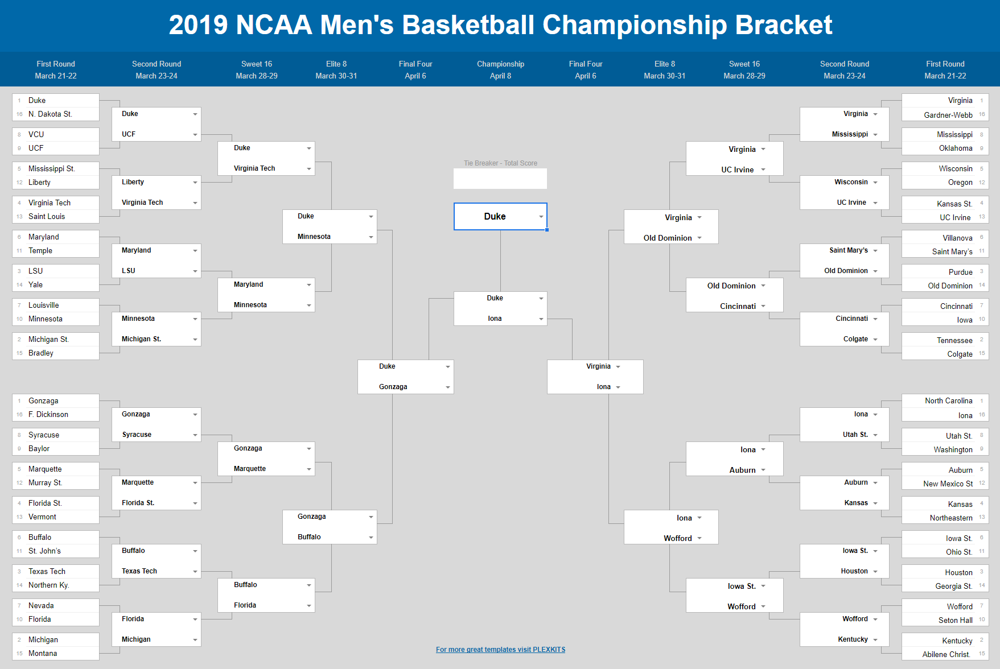

# Introduction

#### What is March Madness?
March Madness is a National Collegiate Athletic Association (NCAA) college basketball single-elimination tournament that occurs in March. There are 68 teams that are divided into four regions and placed into a bracket, which lays out the path a team must take to reach the finals. Each team is seeded or ranked within its region, from 1 to 16 [1].

#### Why Do We Care?
At tournament time each year, millions of people fill out their own brackets, attempting to predict the outcome of all sixty-seven games and achieve a perfect bracket. The chances of forecasting the winner of every game correctly is less than 1 in 9.2 quintillion (or more precisely, 9,223,372,036,854,775,808)! [1].  In recent years, computer scientists have begun trying to predict the tournament using data analytics and machine learning.

# Motivation
#### Machine Learning Madness

Machine Learning Madness is a competition that Google Cloud hosts each year. In this competition, machine learning algorithms face off to see how closely they can predict the perfect bracket.  Our participation in this competition provides us with valuable experience in statistics, data modeling, and cloud technology, as well as an opportunity to win some of the prize money (totaling $25,000)!  

#### Our Goal
We will generate predictions for all 67 games that took place in this year's March Madness and hope to predict at least 51 games accurately.  We chose 51 games because simply choosing the better seeded team in all 67 games results in an average accuracy of 76% (or 51 games) [3].  We hope our algorithm can predict at least a few upsets accurately. We also hope to achieve log loss less than or equal to 0.50 beause the overall winners of this year's competition achieved log loss between 0.41477 and 0.43148 [4]. 

# Data Overview

#### Data Description
- Source: Sports Reference [2]
- Two categories:
    - Basic Data: data related to the team's overall playing statistics
        - Features: Wins, Losses, Simple Ranking, Schedule Difficulty, Conference Wins, Conference Losses, Home Wins,                   Home Losses, Away Wins, Away Losses, Points, Points Against, Field Goals, Field Goal Attempts, 3 Pointers, 3 Point             Attempts, Free Throws, Free Throw Attempts, Offensive Rebounds, Total Rebounds, Assists, Steals, Blocks, Turnover             Percentage, PersonalFouls  
        - Each of these statistics is highly relevant to a team's performance and competetiveness. Our dataset also included a           number of advanced statistics, but we found that the majority of them were derived from the others with respect to             time or other stats, so we disregarded these numbers. 
    - Playoff Data: data related to the team's seed and wins/losses in the past March Madness tournaments
        - Features: Winner Name, Winner Seed, Loser Name, Loser Seed
        - When we used our data as inputs to our functions, we removed team names to prevent association of victory with                 specific schools instead of seeds because a team's strength could differ from year to year. 

#### Splitting Data for Training and Testing
We gathered a total of 19 past March Madness tournaments from 2000-2001 to 2018-2019. Older tournaments had less teams, missing data, or a different tournament format
- Training: 16 of the 19 tournaments (2000-2001 to 2015-2016)
- Testing: 3 of the 19 tournaments (2016-2017 to 2018-2019)

#### Processing and Formatting Data
After getting our data, we needed to reformat the data, which was in csv files, into numpy arrays. To achieve this, we used the Pandas library for easy imports and reformatting. Using the playoff data, we know which two teams play in each game, so for each game, we took the difference of the two teams' basic stats. This is so that we can easily feed the teams' difference into the model to train it to learn which team won based on the teams' differences. For our labels, if the first team in the game won, it is labelled 1; otherwise, it is 0, meaning the second team won instead.

# Methods
Once the data was processed into the appropriate input arrays for training and testing, we needed to actually pick models to train. There has been a huge variety of successful algorithms used by a number of experts in the field for related problems, so we picked the most popular methods from these experts to fully explore the possibilities. In particular, we focused on several classification algorithms to differentiate winners from losers.

#### Linear Regression
Linear Regression tries to find a linear relationship between the input, the differences between the teams' stats, and output, whether the first team won or not, so when our model is training, it tries to find the best fit line to predict output given the input [5]. Linear Regression was the first algorithm we successfully implemented using the sklearn library. It returned a classification range from -30 to 400, so we had to normalize our data between 0 and 1 to obtain the probabilities of a team winning in a particular matchup, and our log loss is calculated below.

Log Loss: 0.63213

#### Ridge Regression
Once we had Linear Regression implemented, it was very easy to add Ridge Regression in. We chose to use Ridge Regression to prevent overfitting our model to our training data, and it proved to be slightly more helpful.  

Log Loss: 0.63210

#### K-Nearest Neighbors (KNN)
KNN groups the games that are similar in the differences of the teams' stats, and based on the majority label of each neighbor in the group, KNN labels each group. KNN was the first of our methods that had a log loss below 0.6, so we also calculated our accuracy of model's predictions of the 2018-2019 bracket.  

Log Loss: 0.58330
Accuracy: 0.71428

#### Neural Nets
For neural net, we had five layers, and each layer used the sigmoid as the activation function. The optimizer that was used for the model was adam, which optimized the loss during each epoch. The output of the neural net was the probability of the first team winning in each game. The neural net was the first of our algorithms to surpass our accuracy goal of 76%. The graph here shows how our loss decreased during our training. 

  

Test loss: 0.61184
Accuracy: 0.76190

#### Random Forest  
Random Forest takes a weighted majority vote of multiple decision trees to determine the label of input data. By using the majority vote, this increases the accuracy and controls overfitting [6]. Random Forest has better results than neural net did in that it had a higher accuracy and lower log loss.

Log Loss: 0.41800
Accuracy: 0.82539 

#### Gradient Boosting  
Boosting is a famous technique that utilizies a combination of weaker classifiers to create a stronger classifier. Gradient boosting uses a more sophisticated combination of decision trees to better classify inputs without being heavily affected by noise. This results in the best accuracy and lowest log loss.  

Log Loss: 0.40913
Accuracy: 0.84126 

# Conclusion

#### Which method had the most accuracy?
Our log loss was at its worst with Linear Regression at 0.63213. At its lowest, we achieved .409 with Gradient Boosting for our tournament prediction. Our accuracy reached a peak at 84% with Gradient Boosting, which is a huge improvement over our goal of 76% accuracy. Below, we have a comparison of the log loss of our algorithms as well as our best predicted bracket for the 2018-2019 tournament. 

# References
[1] https://www.wonderopolis.org/wonder/what-is-march-madness

[2] https://www.sports-reference.com/cbb/seasons/

[3] https://medium.com/re-hoop-per-rate/training-a-neural-network-to-fill-out-my-march-madness-bracket-2e5ee562eab1

[4] https://www.kaggle.com/c/mens-machine-learning-competition-2019/leaderboard

[5] https://www.geeksforgeeks.org/ml-linear-regression/

[6] https://scikit-learn.org/stable/modules/generated/sklearn.ensemble.RandomForestClassifier.html

#### Images
- https://websterapartments.org/wp-content/uploads/2015/03/MarchMadness-main-1024x394.jpg
- https://www.ncaa.com/sites/default/files/public/styles/original/public-s3/images/2019/04/09/ncaa-tournament-bracket-2019-scores-games-virginia-texas-tech.png?itok=0E3VNWmI
- https://www.ncaa.com/sites/default/files/public/styles/focal_point_large/public-s3/images/2019-06-27/2020-NCAA-bracket-March-Madness_0.jpg?h=40a071cb&itok=R2ic4qTy

## Thank you
